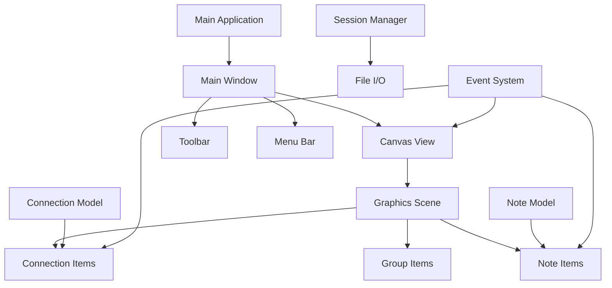

# Design Document

## Overview

The Digital Whiteboard application is built using PyQt6 and follows the Model-View-Controller (MVC) architectural pattern. The core of the application is a custom QGraphicsView-based canvas that provides infinite scrolling, zooming, and interactive note management. The design emphasizes modularity, extensibility, and performance for handling large numbers of notes and connections.

## Architecture

### High-Level Architecture



### Core Components

1. **MainWindow**: Primary application window with menu bar, toolbar, and canvas
2. **WhiteboardCanvas**: Custom QGraphicsView for handling user interactions
3. **WhiteboardScene**: Custom QGraphicsScene managing all drawable items
4. **NoteItem**: Custom QGraphicsItem representing individual notes
5. **ConnectionItem**: Custom QGraphicsItem for lines/arrows between notes
6. **GroupItem**: Custom QGraphicsItem for background grouping shapes
7. **SessionManager**: Handles saving/loading whiteboard sessions

## Components and Interfaces

### MainWindow Class

```python
class MainWindow(QMainWindow):
    """Main application window containing all UI elements"""

    def __init__(self):
        # Initialize canvas, toolbar, menu bar
        # Set up layouts and connections

    def setup_ui(self) -> None:
        # Create and configure UI elements

    def setup_menu_bar(self) -> None:
        # File, Edit, View, Tools menus

    def setup_toolbar(self) -> None:
        # Quick access tools for common actions

    def toggle_fullscreen(self) -> None:
        # Handle fullscreen mode switching
```

### WhiteboardCanvas Class

```python
class WhiteboardCanvas(QGraphicsView):
    """Custom graphics view handling user interactions and canvas navigation"""

    note_created = pyqtSignal(QPointF)  # Signal for new note creation
    connection_requested = pyqtSignal(NoteItem, NoteItem)  # Signal for connections

    def __init__(self, scene: WhiteboardScene):
        # Configure view settings (antialiasing, drag mode, etc.)

    def mouseDoubleClickEvent(self, event: QMouseEvent) -> None:
        # Handle note creation on double-click

    def mousePressEvent(self, event: QMouseEvent) -> None:
        # Handle selection and drag initiation

    def mouseMoveEvent(self, event: QMouseEvent) -> None:
        # Handle dragging and connection drawing

    def wheelEvent(self, event: QWheelEvent) -> None:
        # Handle zooming with mouse wheel

    def keyPressEvent(self, event: QKeyEvent) -> None:
        # Handle keyboard shortcuts
```

### NoteItem Class

```python
class NoteItem(QGraphicsTextItem):
    """Individual note item with text editing and styling capabilities"""

    position_changed = pyqtSignal(QPointF)
    content_changed = pyqtSignal(str)
    style_changed = pyqtSignal(dict)

    def __init__(self, text: str = "", position: QPointF = QPointF(0, 0)):
        # Initialize note with default styling

    def paint(self, painter: QPainter, option: QStyleOptionGraphicsItem, widget: QWidget) -> None:
        # Custom painting for note appearance

    def mousePressEvent(self, event: QGraphicsSceneMouseEvent) -> None:
        # Handle note selection and drag initiation

    def focusInEvent(self, event: QFocusEvent) -> None:
        # Enter edit mode

    def focusOutEvent(self, event: QFocusEvent) -> None:
        # Exit edit mode and save content

    def set_style(self, style_dict: dict) -> None:
        # Apply custom styling (colors, fonts, etc.)

    def get_connection_points(self) -> List[QPointF]:
        # Return points where connections can attach
```

### ConnectionItem Class

```python
class ConnectionItem(QGraphicsPathItem):
    """Connection line/arrow between two notes"""

    def __init__(self, start_note: NoteItem, end_note: NoteItem):
        # Initialize connection between two notes

    def update_path(self) -> None:
        # Recalculate connection path when notes move

    def paint(self, painter: QPainter, option: QStyleOptionGraphicsItem, widget: QWidget) -> None:
        # Draw connection line with arrow

    def contextMenuEvent(self, event: QGraphicsSceneContextMenuEvent) -> None:
        # Right-click menu for connection options (delete, style)
```

### GroupItem Class

```python
class GroupItem(QGraphicsRectItem):
    """Background grouping shape for organizing related notes"""

    def __init__(self, notes: List[NoteItem]):
        # Initialize group containing specified notes

    def update_bounds(self) -> None:
        # Adjust group size based on contained notes

    def add_note(self, note: NoteItem) -> None:
        # Add note to group

    def remove_note(self, note: NoteItem) -> None:
        # Remove note from group
```

### SessionManager Class

```python
class SessionManager:
    """Handles saving and loading whiteboard sessions"""

    def save_session(self, scene: WhiteboardScene, filepath: str) -> bool:
        # Serialize scene data to file

    def load_session(self, filepath: str) -> dict:
        # Deserialize scene data from file

    def auto_save(self, scene: WhiteboardScene) -> None:
        # Automatic saving functionality

    def export_formats(self) -> List[str]:
        # Available export formats (PNG, SVG, PDF)
```

## Data Models

### Note Data Structure

```python
@dataclass
class NoteData:
    id: str
    text: str
    position: Tuple[float, float]
    size: Tuple[float, float]
    style: Dict[str, Any]  # colors, fonts, etc.
    created_at: datetime
    modified_at: datetime
```

### Connection Data Structure

```python
@dataclass
class ConnectionData:
    id: str
    start_note_id: str
    end_note_id: str
    style: Dict[str, Any]  # line style, color, arrow type
    created_at: datetime
```

### Group Data Structure

```python
@dataclass
class GroupData:
    id: str
    note_ids: List[str]
    style: Dict[str, Any]  # background color, border style
    created_at: datetime
```

### Session Data Structure

```python
@dataclass
class SessionData:
    version: str
    notes: List[NoteData]
    connections: List[ConnectionData]
    groups: List[GroupData]
    canvas_state: Dict[str, Any]  # zoom, pan position
    created_at: datetime
    modified_at: datetime
```

## Error Handling

### Exception Hierarchy

```python
class WhiteboardError(Exception):
    """Base exception for whiteboard application"""
    pass

class FileOperationError(WhiteboardError):
    """Errors related to file I/O operations"""
    pass

class RenderingError(WhiteboardError):
    """Errors related to graphics rendering"""
    pass

class ValidationError(WhiteboardError):
    """Errors related to data validation"""
    pass
```

### Error Handling Strategy

1. **File Operations**: Graceful handling of file access errors with user notifications
2. **Memory Management**: Monitor memory usage for large canvases and implement cleanup
3. **Rendering Issues**: Fallback rendering modes for performance issues
4. **Data Corruption**: Validation and recovery mechanisms for session files
5. **User Input**: Sanitization and validation of user-provided content

### Logging Strategy

```python
import logging

# Configure logging levels
logging.basicConfig(
    level=logging.INFO,
    format='%(asctime)s - %(name)s - %(levelname)s - %(message)s',
    handlers=[
        logging.FileHandler('whiteboard.log'),
        logging.StreamHandler()
    ]
)
```

## Testing Strategy

### Unit Testing

- **Model Classes**: Test data structures and validation logic
- **Item Classes**: Test individual note, connection, and group behaviors
- **Utility Functions**: Test helper functions and algorithms
- **File I/O**: Test session saving/loading with various data scenarios

### Integration Testing

- **Canvas Interactions**: Test mouse and keyboard event handling
- **Scene Management**: Test adding/removing items from scene
- **Cross-Component Communication**: Test signal/slot connections
- **Performance**: Test with large numbers of notes and connections

### UI Testing

- **User Workflows**: Test complete user scenarios (create, connect, save)
- **Accessibility**: Test keyboard navigation and screen reader compatibility
- **Visual Regression**: Test UI appearance across different platforms
- **Responsive Behavior**: Test window resizing and fullscreen mode

### Test Structure

```python
# tests/test_note_item.py
class TestNoteItem(unittest.TestCase):
    def setUp(self):
        self.app = QApplication([])
        self.note = NoteItem("Test Note")

    def test_note_creation(self):
        # Test note initialization

    def test_text_editing(self):
        # Test text modification

    def test_styling(self):
        # Test style application

    def tearDown(self):
        self.app.quit()
```

### Performance Testing

- **Memory Usage**: Monitor memory consumption with large canvases
- **Rendering Performance**: Measure frame rates during interactions
- **File I/O Performance**: Test save/load times with large sessions
- **Startup Time**: Measure application launch performance

## Platform Considerations

### Cross-Platform Compatibility

- **File Paths**: Use `pathlib.Path` for cross-platform file handling
- **Fonts**: Provide fallback fonts for different operating systems
- **Shortcuts**: Platform-specific keyboard shortcuts (Cmd vs Ctrl)
- **Window Management**: Handle platform-specific window behaviors

### PyQt6 Specific Considerations

- **High DPI Support**: Enable high DPI scaling for modern displays
- **Theme Integration**: Respect system dark/light mode preferences
- **Resource Management**: Proper cleanup of Qt objects to prevent memory leaks
- **Signal/Slot Performance**: Efficient event handling for responsive UI
