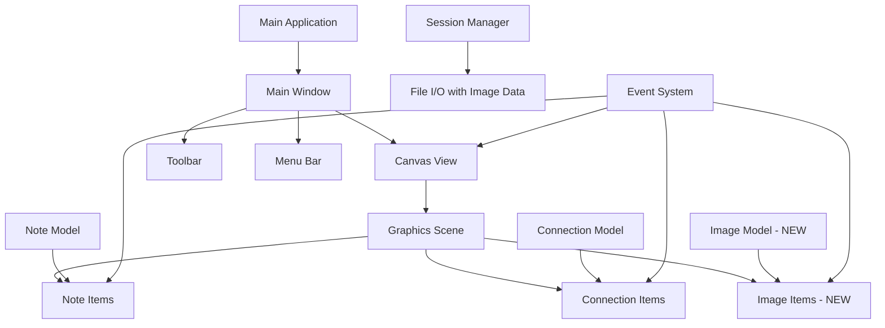

# Design Document

## Overview

The Image Support feature extends the Digital Whiteboard application by adding a new `ImageItem` class that integrates seamlessly with the existing PyQt6-based architecture. The design follows the same patterns established by `NoteItem` and `ConnectionItem`, ensuring consistent behavior for drag-and-drop operations, resizing, movement, and connection creation. Images will be stored as embedded base64 data within session files to maintain portability and simplicity.

## Architecture

### High-Level Architecture Integration



### New Components

1. **ImageItem**: Custom QGraphicsPixmapItem for displaying and manipulating images
2. **ImageDropHandler**: Handles drag-and-drop operations from file system
3. **ImageResizeHandle**: Provides visual resize handles for images
4. **Enhanced SessionManager**: Extended to handle image data serialization

## Components and Interfaces

### ImageItem Class

```python
class ImageItem(QGraphicsPixmapItem):
    """
    Individual image item with resize, move, and connection capabilities.

    A custom QGraphicsPixmapItem that provides image display functionality,
    resize handles, drag-and-drop support, and connection points for linking
    with notes and other images.
    """

    # Signals
    position_changed = pyqtSignal(QPointF)
    size_changed = pyqtSignal(QSizeF)
    rotation_changed = pyqtSignal(float)
    opacity_changed = pyqtSignal(float)
    hover_started = pyqtSignal(str)  # Emits hint text
    hover_ended = pyqtSignal()

    def __init__(self, image_data: bytes, position: QPointF = QPointF(0, 0)):
        # Initialize with image data and position

    def set_image_from_data(self, image_data: bytes) -> None:
        # Load image from binary data

    def get_image_data(self) -> bytes:
        # Return image as binary data for serialization

    def get_connection_points(self) -> List[QPointF]:
        # Return connection points around image perimeter

    def show_resize_handles(self) -> None:
        # Display resize handles when selected

    def hide_resize_handles(self) -> None:
        # Hide resize handles when deselected

    def resize_to_size(self, new_size: QSizeF, maintain_aspect: bool = True) -> None:
        # Resize image with optional aspect ratio preservation

    def set_opacity(self, opacity: float) -> None:
        # Set image transparency

    def rotate_by_degrees(self, degrees: float) -> None:
        # Rotate image by specified degrees
```

### ImageDropHandler Class

```python
class ImageDropHandler:
    """
    Handles drag-and-drop operations for image files.

    Integrates with WhiteboardCanvas to detect image file drops,
    validate file formats, and create ImageItem instances.
    """

    SUPPORTED_FORMATS = ['.png', '.jpg', '.jpeg', '.gif', '.bmp', '.svg']

    def __init__(self, canvas: WhiteboardCanvas):
        # Initialize with canvas reference

    def is_image_file(self, file_path: str) -> bool:
        # Check if file is a supported image format

    def handle_drop_event(self, event: QDropEvent, drop_position: QPointF) -> bool:
        # Process dropped files and create ImageItem if valid

    def load_image_from_file(self, file_path: str) -> bytes:
        # Load image file and return as binary data

    def validate_image_size(self, image_data: bytes) -> bool:
        # Validate image dimensions and file size
```

### ImageResizeHandle Class

```python
class ImageResizeHandle(QGraphicsRectItem):
    """
    Visual resize handle for image items.

    Provides corner and edge handles for resizing images with
    visual feedback and constraint handling.
    """

    class HandleType(Enum):
        CORNER_TOP_LEFT = "corner_tl"
        CORNER_TOP_RIGHT = "corner_tr"
        CORNER_BOTTOM_LEFT = "corner_bl"
        CORNER_BOTTOM_RIGHT = "corner_br"
        EDGE_TOP = "edge_t"
        EDGE_RIGHT = "edge_r"
        EDGE_BOTTOM = "edge_b"
        EDGE_LEFT = "edge_l"

    def __init__(self, handle_type: HandleType, parent_image: ImageItem):
        # Initialize handle with type and parent reference

    def update_position(self) -> None:
        # Update handle position based on parent image bounds

    def start_resize(self, start_pos: QPointF) -> None:
        # Begin resize operation

    def update_resize(self, current_pos: QPointF, maintain_aspect: bool) -> None:
        # Update resize during drag operation

    def finish_resize(self) -> None:
        # Complete resize operation
```

### Enhanced WhiteboardCanvas Integration

```python
# Extensions to existing WhiteboardCanvas class
class WhiteboardCanvas(QGraphicsView):

    # New signals for image support
    image_created = pyqtSignal(ImageItem)
    image_dropped = pyqtSignal(ImageItem, QPointF)

    def __init__(self, scene: WhiteboardScene, parent=None):
        # ... existing initialization ...

        # Setup image drop handling
        self._image_drop_handler = ImageDropHandler(self)
        self.setAcceptDrops(True)

    def dragEnterEvent(self, event: QDragEnterEvent) -> None:
        # Handle drag enter for image files

    def dragMoveEvent(self, event: QDragMoveEvent) -> None:
        # Provide visual feedback during drag

    def dropEvent(self, event: QDropEvent) -> None:
        # Handle image file drops

    def _create_image_at_position(self, image_data: bytes, position: QPointF) -> ImageItem:
        # Create new ImageItem and add to scene
```

## Data Models

### Image Data Structure

```python
@dataclass
class ImageData:
    id: str
    image_data: str  # Base64 encoded image data
    original_filename: str
    mime_type: str
    position: Tuple[float, float]
    size: Tuple[float, float]
    rotation: float  # degrees
    opacity: float  # 0.0 to 1.0
    created_at: datetime
    modified_at: datetime
```

### Enhanced Session Data Structure

```python
@dataclass
class SessionData:
    version: str
    notes: List[NoteData]
    connections: List[ConnectionData]
    images: List[ImageData]  # NEW
    groups: List[GroupData]
    canvas_state: Dict[str, Any]
    created_at: datetime
    modified_at: datetime
```

## Connection System Integration

### Connection Point Calculation

Images will provide connection points around their perimeter, similar to notes but adapted for rectangular shapes:

```python
def get_connection_points(self) -> List[QPointF]:
    """Return connection points around image perimeter."""
    rect = self.boundingRect()

    # Calculate points around the perimeter
    points = []

    # Corner points
    points.extend([
        rect.topLeft(), rect.topRight(),
        rect.bottomLeft(), rect.bottomRight()
    ])

    # Edge midpoints
    points.extend([
        QPointF(rect.center().x(), rect.top()),     # Top center
        QPointF(rect.right(), rect.center().y()),   # Right center
        QPointF(rect.center().x(), rect.bottom()),  # Bottom center
        QPointF(rect.left(), rect.center().y())     # Left center
    ])

    # Convert to scene coordinates
    return [self.mapToScene(point) for point in points]
```

### Enhanced ConnectionItem Support

The existing `ConnectionItem` class will be extended to support connections to `ImageItem` objects:

```python
# Extensions to existing ConnectionItem class
def _calculate_connection_points(self) -> Tuple[QPointF, QPointF]:
    """Enhanced to support both NoteItem and ImageItem connections."""

    # Get connection points from both items (notes or images)
    start_points = self._get_item_connection_points(self._start_item)
    end_points = self._get_item_connection_points(self._end_item)

    # Find optimal connection points
    return self._find_closest_points(start_points, end_points)

def _get_item_connection_points(self, item) -> List[QPointF]:
    """Get connection points from any connectable item."""
    if hasattr(item, 'get_connection_points'):
        return item.get_connection_points()
    return [item.mapToScene(item.boundingRect().center())]
```

## Image Processing and Storage

### Image Format Support

- **PNG**: Full support with transparency
- **JPEG**: Full support, converted to RGB if needed
- **GIF**: Static images only (first frame for animated GIFs)
- **BMP**: Full support
- **SVG**: Rasterized to bitmap for consistent rendering

### Image Size Constraints

```python
class ImageConstraints:
    MAX_FILE_SIZE = 10 * 1024 * 1024  # 10MB
    MAX_DIMENSIONS = (4096, 4096)     # 4K resolution
    MIN_DIMENSIONS = (16, 16)         # Minimum visible size
    DEFAULT_MAX_WIDTH = 800           # Default max width for large images
```

### Base64 Encoding Strategy

Images will be stored as base64-encoded strings within the JSON session files:

```python
def encode_image_for_storage(self, image_data: bytes, mime_type: str) -> str:
    """Encode image data for JSON storage."""
    import base64
    encoded = base64.b64encode(image_data).decode('utf-8')
    return f"data:{mime_type};base64,{encoded}"

def decode_image_from_storage(self, data_url: str) -> Tuple[bytes, str]:
    """Decode image data from JSON storage."""
    import base64
    header, encoded = data_url.split(',', 1)
    mime_type = header.split(';')[0].split(':')[1]
    image_data = base64.b64decode(encoded)
    return image_data, mime_type
```

## User Interface Integration

### Drag-and-Drop Visual Feedback

```python
def dragMoveEvent(self, event: QDragMoveEvent) -> None:
    """Provide visual feedback during image drag operations."""
    if self._image_drop_handler.can_accept_drop(event):
        # Show drop zone indicator
        self._show_drop_indicator(self.mapToScene(event.pos()))
        event.acceptProposedAction()
    else:
        event.ignore()

def _show_drop_indicator(self, scene_pos: QPointF) -> None:
    """Display visual indicator for valid drop zone."""
    # Create temporary indicator item
    indicator = QGraphicsEllipseItem(-20, -20, 40, 40)
    indicator.setPen(QPen(QColor(0, 120, 215), 2, Qt.DashLine))
    indicator.setBrush(QBrush(QColor(0, 120, 215, 50)))
    indicator.setPos(scene_pos)
    # Add to scene temporarily
```

### Context Menu Integration

Images will have context menus similar to notes:

```python
def contextMenuEvent(self, event: QGraphicsSceneContextMenuEvent) -> None:
    """Handle right-click context menu for images."""
    menu = QMenu()

    # Image operations
    menu.addAction("🔄 Rotate 90°", lambda: self.rotate_by_degrees(90))
    menu.addAction("🔄 Rotate 180°", lambda: self.rotate_by_degrees(180))
    menu.addAction("🔄 Rotate 270°", lambda: self.rotate_by_degrees(270))

    menu.addSeparator()

    # Opacity control
    opacity_menu = menu.addMenu("👁️ Opacity")
    for opacity in [1.0, 0.8, 0.6, 0.4, 0.2]:
        opacity_menu.addAction(f"{int(opacity*100)}%",
                              lambda o=opacity: self.set_opacity(o))

    menu.addSeparator()

    # Size operations
    menu.addAction("📏 Reset to Original Size", self.reset_to_original_size)
    menu.addAction("🗑️ Delete Image", self.delete_image)

    menu.exec(event.screenPos())
```

## Error Handling

### Image Loading Errors

```python
class ImageError(WhiteboardError):
    """Base exception for image-related errors."""
    pass

class ImageFormatError(ImageError):
    """Exception for unsupported image formats."""
    pass

class ImageSizeError(ImageError):
    """Exception for images that are too large or small."""
    pass

class ImageCorruptionError(ImageError):
    """Exception for corrupted image data."""
    pass
```

### Error Recovery Strategies

1. **Invalid Format**: Show user-friendly error message with supported formats
2. **File Too Large**: Offer to resize image automatically
3. **Corrupted Data**: Provide option to reload from original file
4. **Memory Issues**: Implement image downsampling for large images

## Testing Strategy

### Unit Testing

- **ImageItem Class**: Test image loading, resizing, rotation, opacity
- **ImageDropHandler**: Test file validation, drop handling, format support
- **Connection Integration**: Test connections between images and notes
- **Serialization**: Test image data encoding/decoding

### Integration Testing

- **Canvas Integration**: Test drag-and-drop workflow end-to-end
- **Session Persistence**: Test saving/loading sessions with images
- **Performance**: Test with multiple large images
- **Memory Management**: Test image cleanup and garbage collection

### User Experience Testing

- **Drag-and-Drop Flow**: Test intuitive file dropping
- **Resize Operations**: Test handle visibility and resize behavior
- **Connection Creation**: Test connection workflow with images
- **Context Menu**: Test all image operations

## Performance Considerations

### Memory Management

```python
class ImageCache:
    """Manages image memory usage and caching."""

    def __init__(self, max_cache_size: int = 100 * 1024 * 1024):  # 100MB
        self._cache = {}
        self._max_size = max_cache_size
        self._current_size = 0

    def get_scaled_image(self, image_data: bytes, target_size: QSize) -> QPixmap:
        """Get cached scaled version of image."""

    def cleanup_unused_images(self) -> None:
        """Remove unused images from cache."""
```

### Rendering Optimization

- **Level-of-Detail**: Show lower resolution when zoomed out
- **Lazy Loading**: Load full resolution only when needed
- **Viewport Culling**: Don't render images outside viewport
- **Progressive Loading**: Show placeholder while loading large images

## Platform Considerations

### File System Integration

- **macOS**: Support drag from Finder, Photos app
- **Windows**: Support drag from Explorer, clipboard paste
- **Linux**: Support drag from file managers

### Image Format Handling

- **High DPI**: Proper scaling for Retina/high-DPI displays
- **Color Profiles**: Maintain color accuracy across platforms
- **Memory Limits**: Platform-specific memory constraints

This design ensures that image support integrates seamlessly with the existing whiteboard architecture while providing a rich, intuitive user experience for visual content manipulation.
