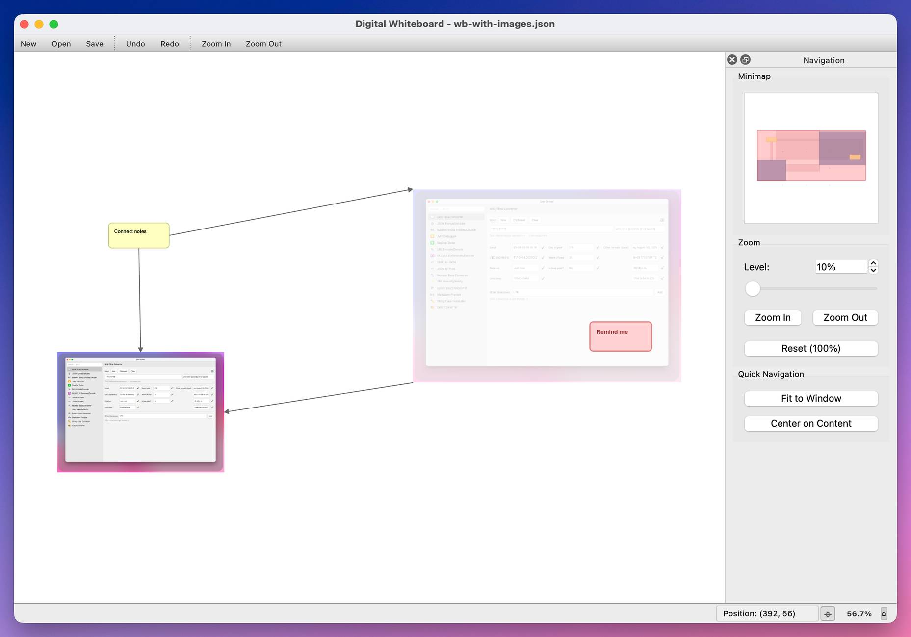

# Whiteboard Application

A powerful, infinite canvas whiteboard application built with PyQt6, featuring advanced zoom and navigation capabilities, note management, and session persistence.



## Features

- **Infinite Canvas**: Expandable workspace that grows automatically
- **Note Management**: Create, edit, and style notes with rich text formatting
- **Image Support**: Add, resize, rotate, and manipulate images
- **Connection System**: Link notes together with visual connections
- **Session Management**: Save and load your work with automatic backup
- **Navigation Panel**: Minimap and zoom controls with real-time updates

## Installation

### Quick Setup (Recommended)

1. **Run the installer**: `./install.command`
   - Installs dependencies and builds the app to `~/Applications`
2. **Launch**: Find "Whiteboard.app" in Applications folder

### Development Setup

1. Install Python 3.12+ and uv: `curl -LsSf https://astral.sh/uv/install.sh | sh`
2. Install dependencies: `uv sync`
3. Run: `make run`

## Keyboard Shortcuts

### Navigation & Zoom

- **Ctrl + Plus/Minus**: Zoom in/out
- **Ctrl + 0**: Reset zoom to 100%
- **Ctrl + 9**: Fit content to window
- **Mouse Wheel + Ctrl**: Zoom at cursor
- **Arrow Keys**: Pan canvas
- **Ctrl + H**: Center on content
- **Space + Drag**: Pan freely
- **Ctrl + Shift + N**: Toggle navigation panel

### File Operations

- **Ctrl + N/O/S**: New/Open/Save
- **Ctrl + Shift + S**: Save as
- **Ctrl + Q**: Quit

### Edit Operations

- **Ctrl + A**: Select all notes
- **Escape**: Clear selection
- **Delete**: Delete selected items
- **F11**: Toggle fullscreen

### Image Operations

- **Drag and Drop**: Add images from file system
- **Right-click**: Access image context menu
- **Resize Handles**: Drag to resize
- **Shift + Resize**: Maintain aspect ratio

## Context Menus

### Canvas (Right-click empty area)

- Create notes and add images
- Select all notes or clear selection
- Reset zoom and view canvas info

### Images (Right-click image)

- **Properties**: View image metadata
- **Resize**: Toggle aspect ratio, reset to original size
- **Rotate**: 90°, 180°, or custom angles
- **Opacity**: Presets (25%, 50%, 75%, 100%) or custom
- **Layer Order**: Bring to front or send to back
- **Delete**: Remove image

## Development

```bash
make test    # Run tests
make check   # Code quality checks
make build   # Build application
```

## Technical Specifications

- **Zoom Range**: 10% to 1000%
- **Auto-save**: 30-second intervals with smart change detection
- **Canvas**: Auto-expands 5000px when within 1000px of edge
- **Compatibility**: Backward compatible with previous session formats

## Tips

- Use **Ctrl + H** to center on content when lost
- Use **Ctrl + 9** for content overview
- **Space + Drag** for quick panning
- Toggle navigation panel for more screen space
